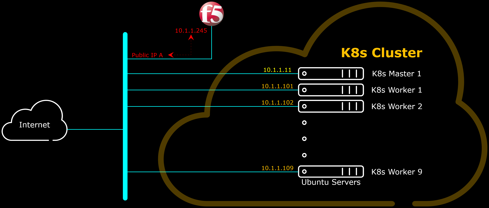
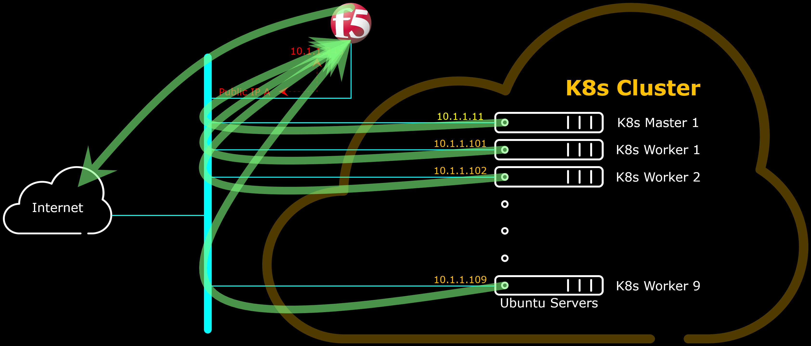
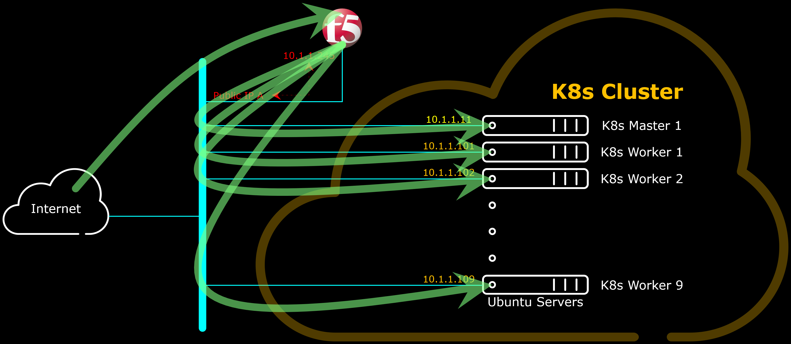

# AWS CloudFormation Templates

## F5 Big-IP Container Ingress Services (Cluster IP Mode)

[CF_F5_1NIC_CIS_K8s_F5-Demo-HTTPD.json](CF_F5_1NIC_CIS_K8s_F5-Demo-HTTPD.json) CloudFormation Template deploys CloudFormation Stack according to the below diagram, where F5 Big-IP is deployed as Gateway between K8s Cluster and the Internet.



The F5 Big-IP provides a gateway for each K8s nodes to connect to services on the Internet, example to download software for installations including to install the K8s cluster itself, as well as further software updates.



(Micro) Services which K8s provides also implemented on F5 Big-IP through orchestration from the K8s cluster using [F5 Big-IP Container Ingress Services](https://clouddocs.f5.com/containers/latest/userguide/what-is.html).



The [CF_F5_1NIC_CIS_K8s_F5-Demo-HTTPD.json](CF_F5_1NIC_CIS_K8s_F5-Demo-HTTPD.json) CloudFormation Template deploys F5 CIS with sample [F5-Demo-HTTPD](https://github.com/f5devcentral/f5-demo-httpd).

<br>

<a href="https://console.aws.amazon.com/cloudformation/home?region=ap-southeast-1#/stacks/new?stackName=F5-CIS-K8s&templateURL=https://aws-f5-singapore-hc-demo-bucket-files.s3-ap-southeast-1.amazonaws.com/CF/CF_F5_1NIC_CIS_K8s_F5-Demo-HTTPD.json"></a>

<br><br><br>


<br><br><br>
***

<br><br><br>
```
╔═╦═════════════════╦═╗
╠═╬═════════════════╬═╣
║ ║ End of Document ║ ║
╠═╬═════════════════╬═╣
╚═╩═════════════════╩═╝
```
<br><br><br>


