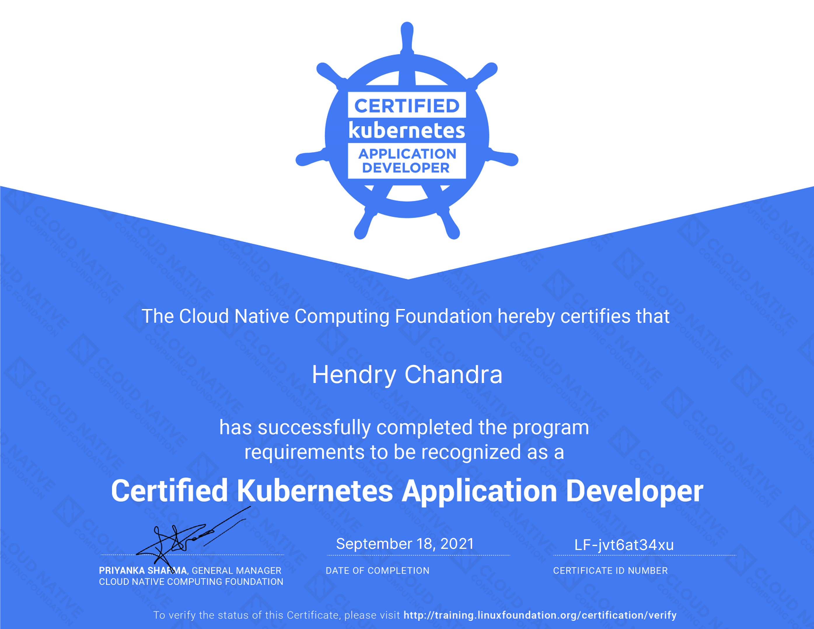

# Certified Kubernetes Application Developer (CKAD)



You can verify the status of the Certificate on [https://training.linuxfoundation.org/certification/verify/](https://training.linuxfoundation.org/certification/verify/) :
- [ ] Copy paste Last Name as it is written on the certificate, including usage of capital and/or small letters : `Chandra`
- [ ] Copy paste Certificate ID as it is written on the certificate, including usage of capital and/or small letters : `LF-jvt6at34xu` .


<br><br><br>
***

<br><br><br>
```
╔═╦═════════════════╦═╗
╠═╬═════════════════╬═╣
║ ║ End of Document ║ ║
╠═╬═════════════════╬═╣
╚═╩═════════════════╩═╝
```
<br><br><br>


