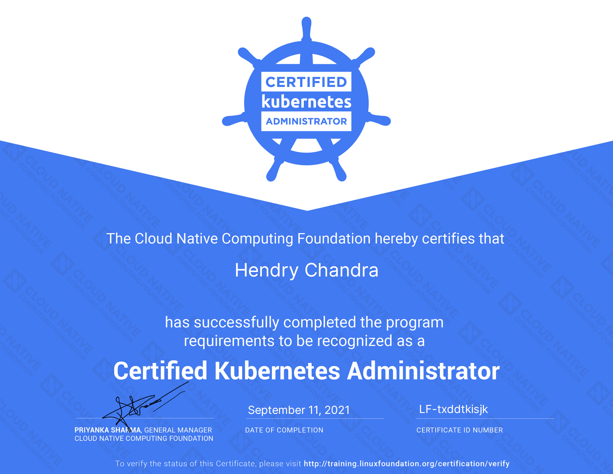

# Certified Kubernetes Administrator (CKA)



You can verify the status of the Certificate on [https://training.linuxfoundation.org/certification/verify/](https://training.linuxfoundation.org/certification/verify/) .
- [ ] Copy paste last name as it is written on the certificate, including usage of capital and/or small letters : `Chandra` .
- [ ] Certificate ID: `LF-txddtkisjk`


<br><br><br>
***

# Certified Kubernetes Application Developer (CKAD)


You can verify the status of the Certificate on [https://training.linuxfoundation.org/certification/verify/](https://training.linuxfoundation.org/certification/verify/) .
- [ ] Copy paste last name as it is written on the certificate, including usage of capital and/or small letters : `Chandra` .
- [ ] Certificate ID: `LF-jvt6at34xu`


<br><br><br>
***

# Certified Kubernetes Security Specialist (CKS)


You can verify the status of the Certificate on [https://training.linuxfoundation.org/certification/verify/](https://training.linuxfoundation.org/certification/verify/) .
- [ ] Copy paste last name as it is written on the certificate, including usage of capital and/or small letters : `Chandra` .
- [ ] Certificate ID: `LF-0kprvdat7p`


<br><br><br>
***

<br><br><br>
```
╔═╦═════════════════╦═╗
╠═╬═════════════════╬═╣
║ ║ End of Document ║ ║
╠═╬═════════════════╬═╣
╚═╩═════════════════╩═╝
```
<br><br><br>


