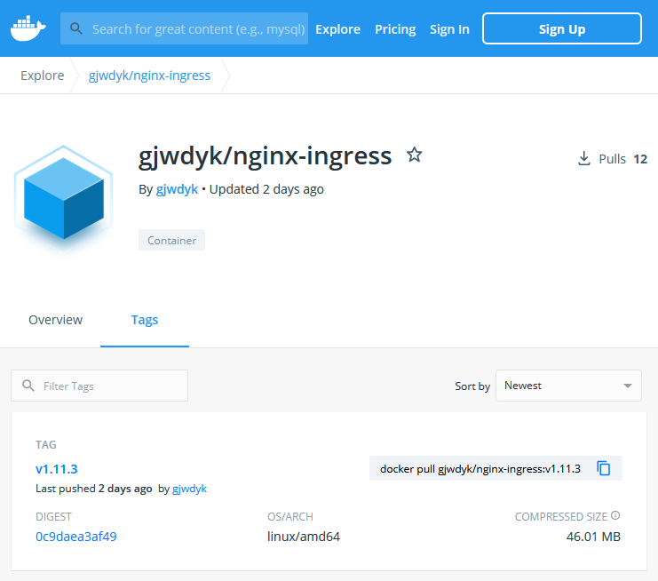
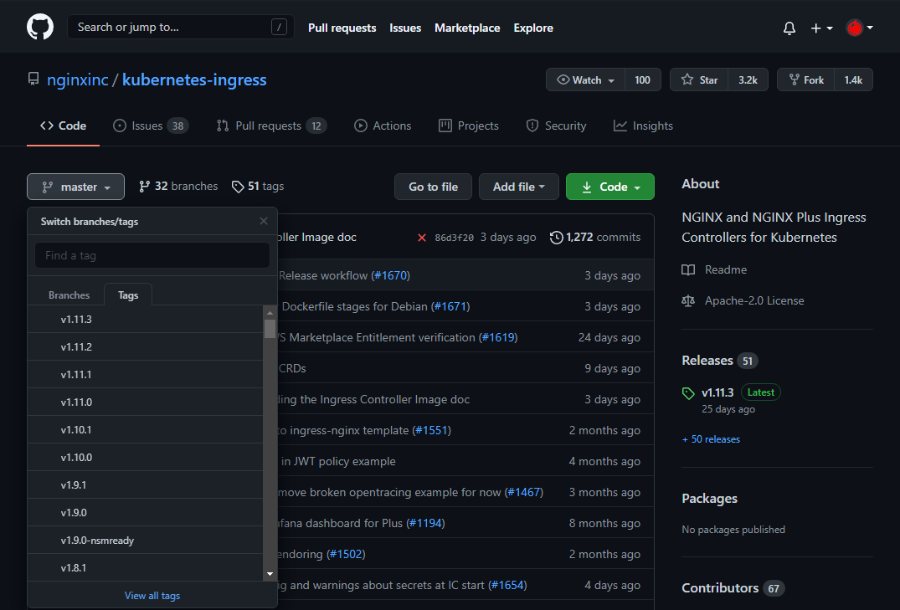

# NGINX+ KIC Container Image in More Details

Table below describes parameters requirement depending on whether you are building/compiling the NGINX+ KIC container image or not; while launching/deploying the CloudFormation template.

| CFT Label (Parameter Name) | When Build/Compile NGINX+ KIC | SKIP Build/Compile NGINX+ KIC |
| --- | --- | --- |
| URL of NGINX+ Compilation Script (CompileNGINXPlusScript) | Mandatory | Mandatory |
| NGINX+ Repository Certificate (NGINXRepositoryCertificate) | Mandatory | Not Needed |
| NGINX+ Repository Private Key (NGINXRepositoryPrivateKey) | Mandatory | Not Needed |
| Repository (Docker Hub) User ID (DockerHubUserID) | Mandatory | Not Needed |
| Repository (Docker Hub) Password (DockerHubPassword) | Mandatory | Not Needed |
| NGINX+'s Repository (Docker Hub) Name (DockerHubRepositoryName) | Mandatory, need to be in sync with "Repository (Docker Hub) User ID" (DockerHubUserID) parameter | Mandatory |
| NGINX+ Version (NGINXPlusVersion) | Mandatory | Mandatory |
| URL of NGINX+ KIC Script (NGINXPlusIngressScript) | Mandatory | Mandatory |

On both cases, the scripts are all mandatory, and there are no differences in usage or treatment between both cases.

<br><br><br>


## When SKIPPING Building/Compiling NGINX+ KIC Container Image

When you select to SKIP building/compiling the NGINX+ KIC container image, you do NOT need to supply the below parameters:
- [ ] NGINX+ Repository Certificate (NGINXRepositoryCertificate)
- [ ] NGINX+ Repository Private Key (NGINXRepositoryPrivateKey)
- [ ] Repository (Docker Hub) User ID (DockerHubUserID)
- [ ] Repository (Docker Hub) Password (DockerHubPassword)

This also means you are using NGINX+ KIC container image which has been built/compiled and stored in some repository somewhere which is ***public***ly accessible.
For example as depicted below:



Following the example above, the:
- [ ] NGINX+'s Repository (Docker Hub) Name (DockerHubRepositoryName) is the complete Repository Name, which is `gjwdyk/nginx-ingress` .
- [ ] NGINX+ Version (NGINXPlusVersion) is the tag (version) of repository you want to choose. From the example above there is only one tag (version) available, which is `v1.11.3` .

This step/procedure also applies when you want to deploy any other service container image where you do not have the source and/or you do not want the hassle to build/compile it, and the service container image is available/publicly accessible on some repository.

<br><br><br>


## When Building/Compiling NGINX+ KIC Container Image

When you select to Build/Compile the NGINX+ KIC container image, that means you do:
- [ ] Build/Compile the NGINX+ KIC container image, and Push/Upload the built/compiled container image to the Repository (Docker Hub) following the configured Account Credentials, Repository Name and Container Image's Tag (Version).
- [ ] Pull/Download the NGINX+ KIC container image from the exact same Repository Name and Container Image's Tag (Version). This step is exactly the same as the above [When SKIPPING Building/Compiling NGINX+ KIC Container Image](#when-skipping-buildingcompiling-nginx-kic-container-image) section. This is why the "NGINX+'s Repository (Docker Hub) Name" (DockerHubRepositoryName) parameter needs to be in sync with the "Repository (Docker Hub) User ID" (DockerHubUserID) parameter.

When you choose to build/compile the NGINX+ KIC container image, choose the tag/version from the [NGINX+ KIC GitHub repository](https://github.com/nginxinc/kubernetes-ingress/) .
As depicted on the below capture, the "branches/tags" drop-down selection lists the available tags/versions.
The "Releases" section on the right side of the page also states the latest tag/version available.
Note that the exact same tag/version string will be used to push the built/compiled NGINX+ KIC container image into your Repository (Docker Hub) Account.

You may want to check whether the compilation process/procedure of commands of the tag/version you choose is still supported (same as) between the provided [NGINX+ Compilation Script](../Bash/CompileNGINXPlus.sh) and the official guide for [Building the NGINX+ KIC Container Image](https://docs.nginx.com/nginx-ingress-controller/installation/building-ingress-controller-image/) .




Push needs credentials (you do not want just anyone can upload trash to your docker hub account).
Pull does not need credentials, since the requirement is that the uploaded container image is for public access.


<br><br><br>


***

<br><br><br>
```
╔═╦═════════════════╦═╗
╠═╬═════════════════╬═╣
║ ║ End of Document ║ ║
╠═╬═════════════════╬═╣
╚═╩═════════════════╩═╝
```
<br><br><br>


