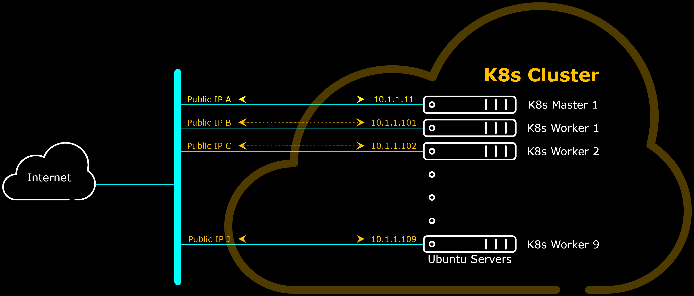
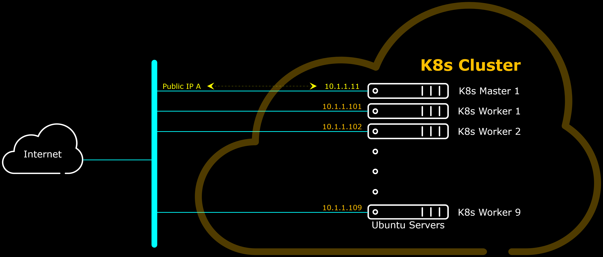
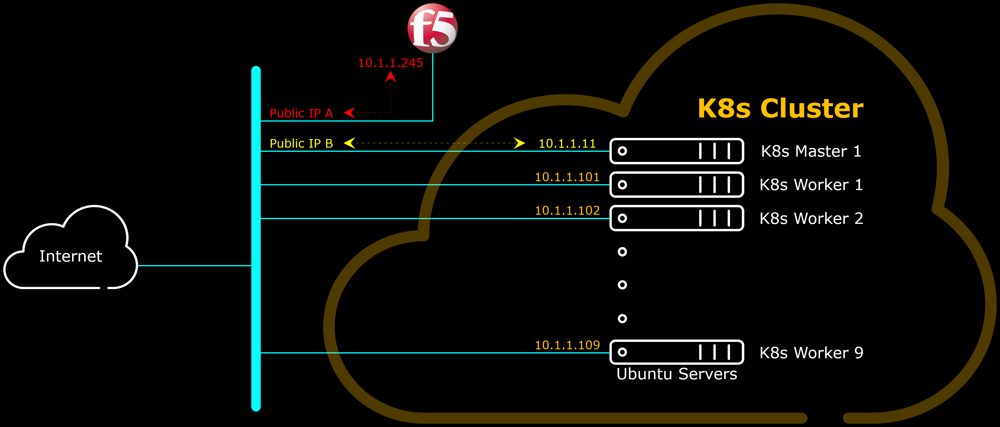

# Notes-K8s

This repository builds a Kubernetes Cluster within a AWS VPC using CloudFormation template as well as bash scripts. The Kubernetes Cluster is built from N units of EC2 Ubuntu servers (where N can be between 1 to 9 worker nodes).
There is only one K8s Master Node built on this repository.

Why not use AWS EKS instead? To have the exposure of provisioning and/or managing the K8s Master Instances, as not everyone who wants to implement containerization service can do it on EKS. Some of us still need to build our own Kubernetes Cluster.
The goal of this repository is to be able to quikly have environment where some demos can be performed; especially ones which involves K8s, NGINX and F5 Big-IP.
Further down the line, the Environment built by this repository will involve F5 CIS and F5 Big-IP, which may not be possible with AWS EKS, since F5 CIS needs tweaks of the internal interworking of the K8s Cluster itself.

Diagram below depicts the logical diagram of nodes within AWS VPC.

## Next

- [ ] 
Public IP Address is needed for each node to install softwares and/or get containers.

- [ ] 
Inconsistent design, either all or none of nodes have Public IP Address.

- [x] 
Nodes Outgoing Traffic to be NAT-ed through Big-IP.
