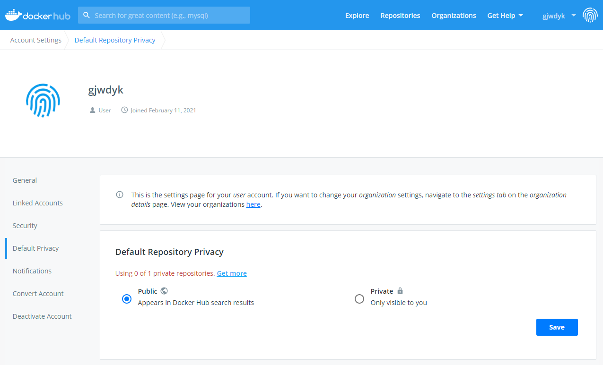

# Notes-K8s

This repository builds a Kubernetes Cluster within a AWS VPC using CloudFormation template as well as bash scripts. The Kubernetes Cluster is built from N units of EC2 Ubuntu servers (where N can be between 1 to 9 worker nodes).
There is only one K8s Master Node built on this repository.

Why not use AWS EKS instead? To have the exposure of provisioning and/or managing the K8s Master Instances, as not everyone who wants to implement containerization service can do it on EKS. Some of us still need to build our own Kubernetes Cluster.
The goal of this repository is to be able to quikly have environment where some demos can be performed; especially ones which involves K8s, NGINX and F5 Big-IP.
Further down the line, the Environment built by this repository will involve F5 CIS and F5 Big-IP, which may not be possible with AWS EKS, since F5 CIS needs tweaks of the internal interworking of the K8s Cluster itself.

Diagram below depicts the logical diagram of nodes within AWS VPC.


Note that the environment created by this CloudFormation template does not provide any security measures to any of the created AWS resources.
Each of the EC2 instances has a Public IP and therefore can be accessed directly from Internet.
Network ACLs and Security Groups allow ALL Types of Traffics.

This CloudFormation template is designed for building Demo/Testing environment only.
It was NOT designed to be used for Live/Commercial environment !!!
This CloudFormation Template is developed by independent individual and therefore is NOT supported by NGINX nor F5 Networks.
Refer to [Disclaimers and Limitations of Liability](#disclaimers-and-limitations-of-liability) for the no-terms and no-conditions under which you can utilize the codes, information, service or any contents of this repository.
***Launching the CloudFormation template will incur costs which AWS will bill to the account on which you launch the CloudFormation Template on.***

Read through the input parameters descriptions below to understand what the CloudFormation template creates and does.
Some further references are provided on the description of each parameter field.

Some of the folders contain further details, specific to the part/subject which the folder covers.


***

## PreRequisites

Before you start launching the CloudFormation template, you need to prepare or to have the followings ready:

- [ ] K8s Nodes SSH Private and Public Key-Pair. Refer to [KeyPair](KeyPair/) for more detail explanations.

- [ ] Have an active and registered AWS Route53 Domain Name, which you have full access to add, create, modify, and delete `A` records.

- [ ] Docker Hub account's credentials. An important note to Docker Hub account is that the "Default Repository Privacy" needs to be set to "Public".
      

- [ ] NGINX+ Repository Certificate and Private Key. The NGINX+ Repository Certificate and Private Key need to be formatted into one-line exactly the same way as described in [KeyPair](KeyPair/). You need to supply NGINX+ Repository Certificate and Private Key, when you need to build the NGINX+ container image as pointed out in [Building the Ingress Controller Image](https://docs.nginx.com/nginx-ingress-controller/installation/building-ingress-controller-image/).


***

## Template Parameters

| CFT Label | Parameter Name | Required | Description |
| --- | --- | --- | --- |
| Stack Name | Stack Name | Mandatory and Unique Across Account | Give a unique name to the CloudFormation stack. Stack name will be used to prefix all resources created by this CloudFormation template. Stack name can include letters (A-Z and a-z), numbers (0-9), and dashes (-). |
| PreFix for Name Tags | TagPreFix | Optional | Give a Prefix to be used for Prefix-Naming all resources created by this CloudFormation template. In an account where there are multiple users, using initial will help to identify who owns the resources which this CloudFormation template creates. |
| K8s Nodes' Image ID | K8sNodeImageID | Mandatory with Default Value | Input a valid AMI ID of a Ubuntu Server to be used for the K8s Nodes. The Default AMI ID are based on https://cloud-images.ubuntu.com/locator/ec2/ . |
| K8s Nodes' Image Type | K8sNodeImageType | Mandatory with Default Value | Select an EC2 Image Type for the K8s Nodes. Allowed values are "ubuntu1804amd64", "ubuntu1804arm64", "ubuntu2004amd64", "ubuntu2004arm64" which represent Ubuntu Server version 18.04 and version 20.04 on AMD64 and ARM64 architectures. Note that this repository was tested only on the Default value which is "ubuntu2004amd64". |
| K8s Nodes' Instance Type | K8sNodeInstanceType | Mandatory with Default Value | Select an EC2 Instance Type for the K8s Nodes. Note that instance type also influences the number of CPU and amount of Memory available for the K8s Node. Refer also to official guides from Ubuntu (https://help.ubuntu.com/community/Installation/SystemRequirements) and Kubernetes (https://docs.kublr.com/installation/hardware-recommendation/) on the minimal system requirements for each platform, and pick the largest specification on each aspect. |
| Number of K8s Worker Node(s) | NumberOfK8sWorkerNode | Mandatory with Default Value | Select from 1 to 9 Worker Nodes to be created by the CloudFormation template. |
| EC2 SSH Key-Pair | EC2SSHKeyPair | Optional | This Key-Pair will be used for SSH access into the EC2 instances or the K8s Nodes. Select a Key-Pair from the drop-down list of Existing Key-Pairs. If the Key-Pair you want to use is created after you execute/launch this CloudFormation template (example: on separate browser's tab you created a new Key-Pair after you execute/launch this CloudFormation template), the new Key-Pair will not be shown. You need to assign/use a Key-Pair if you'd like to access any of the K8s Node's CLI. |
| Existing Registered Domain Name in AWS Route53 | ParentDomainName | Optional | NGINX+ Kubernetes Ingress Controller requires domain name for the service's Ingress configuration. Specify an active and registered AWS Route53 Domain Name, which you have full access to add, create, modify, and delete `A` records. |
| K8s Nodes SSH Private Key | K8sSSHPrivateKey | Mandatory | Together with "K8s Nodes SSH Public Key" (K8sSSHPublicKey) they both form a Key-Pair to be used only between K8s Master Node to send instructions to all K8s Worker Nodes. Refer to [KeyPair](KeyPair/) for more detail explanations. |
| K8s Nodes SSH Public Key | K8sSSHPublicKey | Mandatory | Together with "K8s Nodes SSH Private Key" (K8sSSHPrivateKey) they both form a Key-Pair to be used only between K8s Master Node to send instructions to all K8s Worker Nodes. Refer to [KeyPair](KeyPair/) for more detail explanations. |
| Time Zone | TimeZone | Optional with Default Value | Select a Time Zone to be applied for all EC2 instances (i.e. all Kubernetes Nodes). |
| URL of OS Preparation Script | OSPreparationScript | Mandatory with Default Value | URL of a bash script used to prepare the Ubuntu OS for Kubernetes implementation. If the bash script file is located at AWS S3, ensure that this CloudFormation template can read the file. If the bash script file is located at GitHub, ensure that this CloudFormation template can read the RAW file (i.e. not a web page containing the file). |
| URL of Docker Preparation Script | DockerPreparationScript | Mandatory with Default Value | URL of a bash script used to prepare the containerization platform for Kubernetes implementation (e.g. Docker). If the bash script file is located at AWS S3, ensure that this CloudFormation template can read the file. If the bash script file is located at GitHub, ensure that this CloudFormation template can read the RAW file (i.e. not a web page containing the file). |
| URL of Common K8s Preparation Script | CommonK8sPreparationScript | Mandatory with Default Value | URL of a bash script used to prepare the common factors of Kubernetes implementation. If the bash script file is located at AWS S3, ensure that this CloudFormation template can read the file. If the bash script file is located at GitHub, ensure that this CloudFormation template can read the RAW file (i.e. not a web page containing the file). |
| URL of K8s Master Preparation Script | K8sMasterPreparationScript | Mandatory with Default Value | URL of a bash script used to prepare the Kubernetes' master node implementation. If the bash script file is located at AWS S3, ensure that this CloudFormation template can read the file. If the bash script file is located at GitHub, ensure that this CloudFormation template can read the RAW file (i.e. not a web page containing the file). |
| URL of Cluster Networking (flannel) YAML File | ClusterNetworkConfiguration | Mandatory with Default Value | URL of a YAML file to be used to implement a Cluster Networking within the Kubernetes Cluster (e.g. flannel). If the YAML file is located at AWS S3, ensure that this CloudFormation template can read the file. If the YAML file is located at GitHub, ensure that this CloudFormation template can read the RAW file (i.e. not a web page containing the file). |
| URL of K8s Worker Preparation Script | K8sWorkerPreparationScript | Mandatory with Default Value | URL of a bash script used to prepare the Kubernetes' worker nodes implementation. If the bash script file is located at AWS S3, ensure that this CloudFormation template can read the file. If the bash script file is located at GitHub, ensure that this CloudFormation template can read the RAW file (i.e. not a web page containing the file). |
| URL of K8s Fundamental Services Script | K8sServicePreparationScript | Optional with Default Value | URL of a bash script used to deploy fundamental K8s services within the Kubernetes cluster (example: Kubernetes Dashboard, Prometheus and Grafana for Monitoring). If the bash script file is located at AWS S3, ensure that this CloudFormation template can read the file. If the bash script file is located at GitHub, ensure that this CloudFormation template can read the RAW file (i.e. not a web page containing the file). |
| URL of NGINX+ Compilation Script | CompileNGINXPlusScript | Optional with Default Value | URL of a bash script to build/compile NGINX+ container image. If the bash script file is located at AWS S3, ensure that this CloudFormation template can read the file. If the bash script file is located at GitHub, ensure that this CloudFormation template can read the RAW file (i.e. not a web page containing the file). |
| Skip NGINX+ Compilation ? | SkipNGINXPlusCompilation | Optional with Default Value | Whether to Skip Compilation of NGINX+ KIC Container Image. Example: If you have compiled the NGINX+ KIC Container Image before, and want to just re-use that NGINX+ KIC Container Image. |
| NGINX+ Repository Certificate | NGINXRepositoryCertificate | Optional | Blah |
| NGINX+ Repository Private Key | NGINXRepositoryPrivateKey | Optional | Blah |
| Repository (Docker Hub) User ID | DockerHubUserID | Optional | Blah |
| Repository (Docker Hub) Password | DockerHubPassword | Optional | Blah |
| NGINX+'s Repository (Docker Hub) Name | DockerHubRepositoryName | Optional | Blah |
| NGINX+ Version | NGINXPlusVersion | Optional with Default Value | Blah |
| URL of NGINX+ KIC Script | NGINXPlusIngressScript | Optional with Default Value | URL of a bash script to implement NGINX+ as K8s Ingress Controller . If the bash script file is located at AWS S3, ensure that this CloudFormation template can read the file. If the bash script file is located at GitHub, ensure that this CloudFormation template can read the RAW file (i.e. not a web page containing the file). |
| URL of Application Service(s) Script | ApplicationServiceScript | Optional with Default Value | URL of a bash script used to End User's Application Services within the Kubernetes cluster. If the bash script file is located at AWS S3, ensure that this CloudFormation template can read the file. If the bash script file is located at GitHub, ensure that this CloudFormation template can read the RAW file (i.e. not a web page containing the file). |


If you 
Paste the version of NGINX+ KIC to be implemented. [NGINX+ KIC GitHub](https://github.com/nginxinc/kubernetes-ingress/)

Paste the text content of a NGINX+ Repository Certificate (i.e. nginx-repo.crt file). You can skip this parameter if you're also skipping the NGINX+ Compilation.
Paste the text content of a NGINX+ Repository Private Key (i.e. nginx-repo.key file). You can skip this parameter if you're also skipping the NGINX+ Compilation.
User ID used to access to the (Docker Hub) Repository, for uploading to and downloading from the compiled NGINX+ container. You can skip this parameter if you're also skipping the NGINX+ Compilation. Note that the Repository's User ID must be in sync with the Repository's (Complete) Name, which contains also the User ID information.
Password for the User ID to access the (Docker Hub) Repository. You can skip this parameter if you're also skipping the NGINX+ Compilation.
The (Docker Hub) Repository's Name, for uploading to and downloading from the compiled NGINX+ container. In case of Docker Hub, use format UserID/RepositoryName . Note that the supplied Repository's (Complete) Name, which also contains the Repository's User ID information, must be in sync with the Repository's User ID parameter.


***

## Disclaimers and Limitations of Liability

### The Code, Information, Service or Content are Available "AS-IS"

Your access to and use of the Code, Information, Service or any Content in this GitHub repositories are at your own risk.
You understand and agree that the Code, Information, Service or any Content are provided to you on an “AS IS” and “AS AVAILABLE” basis.
The creator of this GitHub repositories (gjwdyk) refers to gjwdyk, parents, children, relatives, friends, acquaintances, affiliates, related companies, any officer of the related companies, coworkers, supervisors, representatives, partners, et cetera (basically anyone and/or any institution who/which has/have any degree of knowledge of gjwdyk, including zero knowledge of gjwdyk).
THE CREATOR OF THIS GITHUB REPOSITORIES (GJWDYK) DISCLAIM ALL WARRANTIES AND CONDITIONS, WHETHER EXPRESS OR IMPLIED, OF MERCHANTABILITY, FITNESS FOR A PARTICULAR PURPOSE, OR NON-INFRINGEMENT.
The creator of this GitHub repositories (gjwdyk) make no warranty or representation and disclaim all responsibility and liability for:
(i) the completeness, accuracy, availability, timeliness, security or reliability of the Code, Information, Service or any Content;
(ii) any harm to your computer system or your account(s), loss of data, or ANY other harm, loss or damage that results from your access to or use of the Code, Information, Service or any Content;
(iii) the deletion of, or the failure to store or to transmit, any Code, Information or Content and other communications maintained by the Codes or Information or Services; and
(iv) whether the Codes or Information or Services or Contents will meet your requirements or be available on an uninterrupted, intermittent, secure, vulnerable, error-free, flawful or harmless basis.
No advice or information, whether oral or written, obtained from the creator of this GitHub repositories (gjwdyk) or through ANY other communication means or channels, will create any warranty or representation not expressly made herein.

### Limitation of Liability

THE CREATOR OF THIS GITHUB REPOSITORIES (GJWDYK) SHALL NOT BE LIABLE FOR ANY DIRECT, INDIRECT, INCIDENTAL, SPECIAL, CONSEQUENTIAL OR PUNITIVE DAMAGES, OR ANY LOSS OF CAPITALS, PROFITS OR REVENUES, WHETHER INCURRED DIRECTLY OR INDIRECTLY, OR ANY LOSS OF DATA, USE, GOODWILL, OR OTHER TANGIBLE OR INTANGIBLE LOSSES, RESULTING FROM
(i) YOUR ACCESS TO OR USE OF OR INABILITY TO ACCESS OR USE THE CODE, INFORMATION, SERVICE OR ANY CONTENT;
(ii) ANY CONDUCT OR CONTENT OF ANY THIRD PARTY ON THE CODE, INFORMATION, SERVICE OR ANY CONTENT, INCLUDING WITHOUT LIMITATION, ANY DEFAMATORY, OFFENSIVE OR ILLEGAL CONDUCT OF OTHER USERS OR THIRD PARTIES;
(iii) ANY CODE, INFORMATION, SERVICE OR ANY CONTENT OBTAINED FROM THESE REPOSITORIES DIRECTLY OR INDIRECTLY FROM ANYWHERE ELSE IN THE INTERNET WHICH REFERS DIRECTLY OR INDIRECTLY TO THESE REPOSITORIES; OR
(iv) UNAUTHORIZED ACCESS, USE OR ALTERATION OF YOUR RESOURCES, ACCOUNT, DATA, OR CONTENTS.
THE LIMITATIONS OF THIS SUBSECTION SHALL APPLY TO ANY THEORY OF LIABILITY, WHETHER BASED ON WARRANTY, CONTRACT, STATUTE, TORT (INCLUDING NEGLIGENCE) OR OTHERWISE, AND WHETHER OR NOT THE CREATOR OF THIS GITHUB REPOSITORIES (GJWDYK) HAVE BEEN INFORMED OF THE POSSIBILITY OF ANY SUCH DAMAGE, AND EVEN IF A REMEDY SET FORTH HEREIN IS FOUND TO HAVE FAILED OF ITS ESSENTIAL PURPOSE.

<a href="https://console.aws.amazon.com/cloudformation/home?region=ap-southeast-1#/stacks/new?stackName=BigIP-Lab&templateURL=https://aws-f5-singapore-hc-demo-bucket-files.s3-ap-southeast-1.amazonaws.com/CF/CF_BigIP_Lab_AS3.25_TMSH_UpGrade_Region_Original.json"></a>
<a href="https://console.aws.amazon.com/cloudformation/home?region=ap-southeast-1#/stacks/new?stackName=BigIP-Lab&templateURL=https://aws-f5-singapore-hc-demo-bucket-files.s3-ap-southeast-1.amazonaws.com/CF/CF_BigIP_Lab_AS3.25_TMSH_UpGrade_Region.json"></a>


***

<br><br><br>
```
╔═╦═════════════════╦═╗
╠═╬═════════════════╬═╣
║ ║ End of Document ║ ║
╠═╬═════════════════╬═╣
╚═╩═════════════════╩═╝
```
<br><br><br>


## Planned Next


Public IP Address is needed for each node to install softwares and/or get containers.


Inconsistent design, either all or none of nodes have Public IP Address.


Nodes Outgoing Traffic to be NAT-ed through Big-IP.


