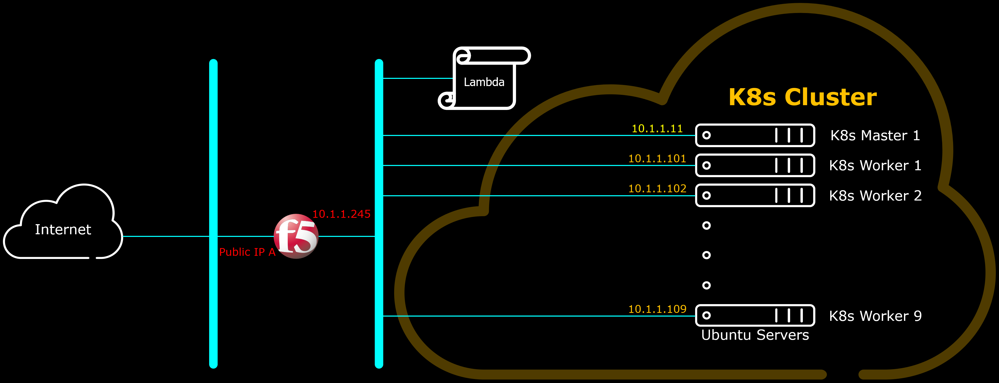

# Plan to be Developed Further

Below is a plan to develop the environment further, to include a Multi-NIC F5 Big-IP CIS; where F5 Big-IP can be orchestrated by Kubernetes to provide also Ingress Controller, Load Balancing as well as Security measures to the Container Services.
Lambda Function to help the CloudFormation Template features is also planned to be added, especially to support multiple services to be served by single IP by both K8s and Big-IP.



<br><br><br>


***

<br><br><br>
```
╔═╦═════════════════╦═╗
╠═╬═════════════════╬═╣
║ ║ End of Document ║ ║
╠═╬═════════════════╬═╣
╚═╩═════════════════╩═╝
```
<br><br><br>


